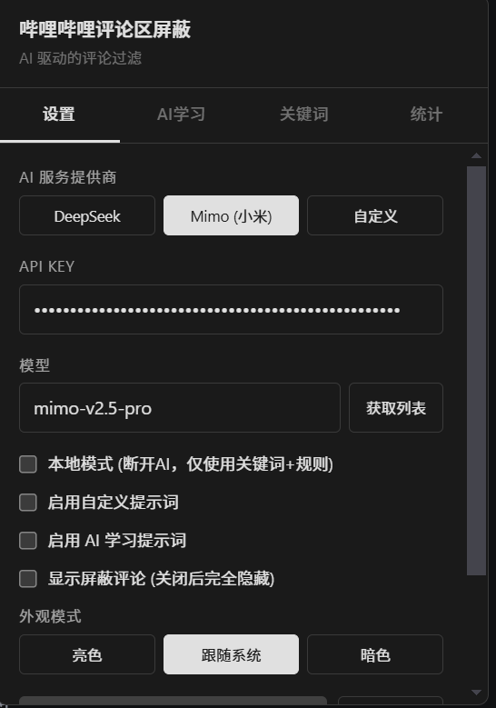
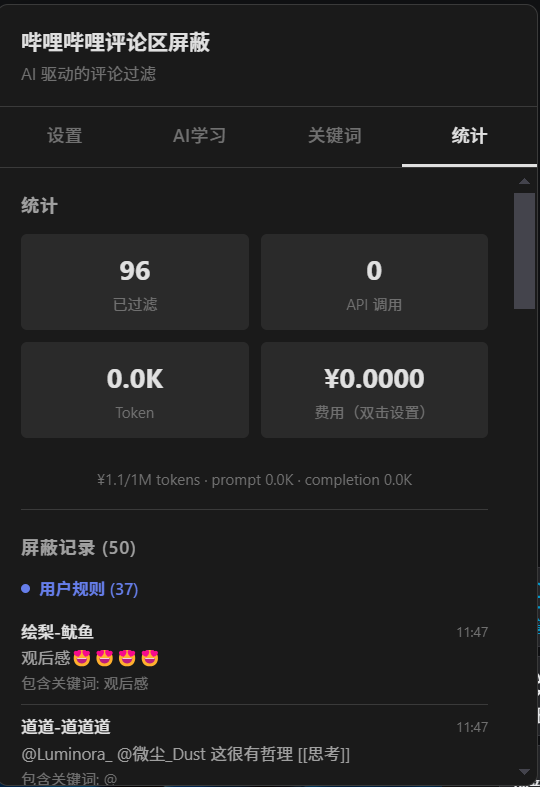
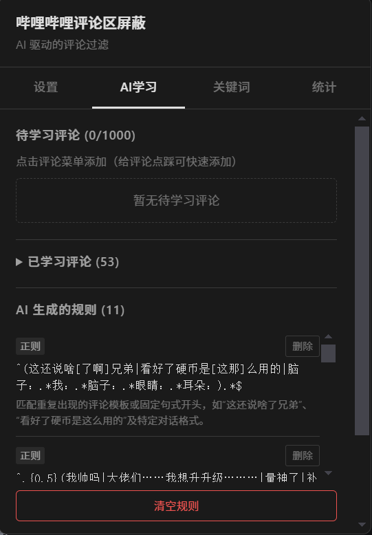

# 哔哩哔哩评论区屏蔽

AI 驱动的 B 站评论过滤器，支持关键词屏蔽、AI 规则学习、深色模式。

## 截图

### 设置面板


### 统计面板


### AI学习面板


---

## 功能特性

### 评论过滤
- **本地关键词过滤** - 支持普通关键词和正则表达式，零延迟即时生效
- **AI 规则过滤** - 支持 DeepSeek、Mimo 等 AI 服务，语义理解更精准
- **简介复读机检测** - 自动屏蔽与视频简介相同的评论
- **缓存机制** - LRU 缓存避免重复 API 调用

### AI 学习
- **标记评论** - 在评论菜单中标记不想看的评论
- **点踩快速标记** - 点击评论点踩自动添加到待学习列表
- **规则学习** - AI 分析标记评论，自动生成正则和关键词规则
- **提示词学习** - 生成总结性提示词用于 AI 判断
- **反馈学习** - 点赞/点踩反馈影响 AI 规则生成

### 数据管理
- **标记评论导出/导入** - JSON 格式，支持增量导入
- **关键词导入/导出** - JSON 格式
- **本地持久化** - IndexedDB 存储，数据不丢失

### 界面
- **深色模式** - 支持亮色、暗色、跟随系统三种模式
- **多标签页** - 设置、AI 学习、关键词、统计四个标签页
- **统计面板** - 显示过滤数量、Token 消耗、费用估算
- **屏蔽记录** - 按来源分组显示（用户规则/AI 规则/简介类/AI 判定/标记/缓存）

## 安装

### 方法一：直接安装
1. 安装 [Tampermonkey](https://www.tampermonkey.net/) 或 [Violentmonkey](https://violentmonkey.github.io/) 浏览器扩展
2. 将 `dist/bilibili-comment-block.user.js` 拖入扩展

### 方法二：从源码构建
```bash
git clone <repo-url>
cd info-cocoon-amplifier-main
npm install
npm run build
```
将 `dist/bilibili-comment-block.user.js` 拖入 Tampermonkey/Violentmonkey。

## 使用

### 基础使用
1. 打开任意 B 站视频页面
2. 点击右下角 **R** 按钮打开设置面板
3. 配置 API Key（可选，仅 AI 功能需要）
4. 开始使用

### AI 功能
1. 在 **设置** 标签页配置 API Key
2. 勾选 **启用自定义提示词**，填写过滤规则
3. 在 **AI 学习** 标签页标记不想看的评论
4. 点击 **开始学习** 生成过滤规则

### 关键词过滤
1. 切换到 **关键词** 标签页
2. 输入关键词或正则表达式
3. 点击添加，立即生效

### 本地模式
勾选 **本地模式** 后，断开 AI 连接，仅使用本地关键词和规则进行过滤，零延迟。

## 配置说明

| 配置项 | 说明 |
|--------|------|
| AI 服务提供商 | DeepSeek / Mimo (小米) / 自定义 |
| API Key | AI 服务的密钥 |
| 模型 | AI 模型名称 |
| 本地模式 | 断开 AI，仅使用本地规则 |
| 启用自定义提示词 | 勾选后显示提示词输入框 |
| 显示屏蔽评论 | 开启后折叠显示，关闭后完全隐藏 |
| Token 单价 | 双击费用设置，用于计算费用 |

## 技术栈

- TypeScript
- Vite + vite-plugin-monkey
- IndexedDB (idb)
- DeepSeek / Mimo API

## 项目结构

```
src/
├── main.ts          # 入口文件
├── interceptor.ts   # DOM 扫描器
├── filter.ts        # 过滤引擎
├── api.ts           # AI API 通信
├── db.ts            # IndexedDB 存储
├── ui.ts            # 用户界面
├── logger.ts        # 日志/黑名单面板
├── types.ts         # 类型定义
└── globals.d.ts     # Tampermonkey API 声明
```

## 致谢

本项目基于 [info-cocoon-amplifier](https://github.com/shawn020308/info-cocoon-amplifier) 二次开发。

## 许可证

MIT
